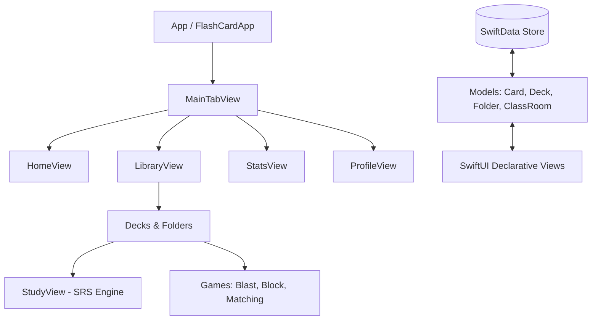

# LuminaCards ⚡️
### *Master Languages. Fast. A Premium Gamified Spaced Repetition iOS Application.*

LuminaCards is a native iOS application designed with a high-fidelity, fluid, "Gen Z Premium" aesthetic (OLED Dark Mode first, vibrant gradients, and rich micro-interactions). It implements a customized **SuperMemo-2 (SM-2) Spaced Repetition Algorithm** to optimize vocabulary learning, paired with three distinct interactive games, detailed activity statistics, nested folder hierarchies, and virtual classroom coordination.

---

## 📱 Key Features

### 1. Spaced Repetition Engine (SM-2 Algorithm)
* **Smart Review Loops**: Uses an SM-2 inspired scheduling algorithm evaluating performance across 4 difficulties: `Again`, `Hard`, `Good`, and `Easy`.
* **Dynamic Interval Adjustment**: Automatically shifts interval calculation, ease factor, and next review timestamps (calculated down to minute intervals for immediate failures).
* **Intuitive Gestures**: Flip cards in 3D (X-axis rotation) and swipe left/right to grade your progress with corresponding haptic feedback.

### 2. Gamified Learning Engines
* **Blast Game**: Fast-paced card matching game that tests rapid association.
* **Block Game**: Tetris-inspired vocabulary sorting game.
* **Matching Game**: Interactive tile matrix matching vocabulary terms with definitions.
* **Quiz Mode**: Segmented multiple-choice quizzes with shake feedback on error and confetti on success.

### 3. Class & Folder Organization
* **Classroom Coordination**: Teachers can create classrooms with unique invitation codes. Students can join, and teachers can share specialized vocabulary decks.
* **Nested Folders**: Multi-level directory structures for organizing decks by language, topic, or target exams.

### 4. Interactive Statistics & Charts
* **Contribution Heatmap**: GitHub-style activity tracker displaying daily study streaks.
* **Skill Radar & Progress Graphs**: Charts illustrating words mastered over time and skill balance.

---

## 🛠️ Architecture & Tech Stack

* **Platform**: iOS 17.0+ (Swift 5.9+)
* **Framework**: SwiftUI (100% Declarative UI)
* **Local Persistence**: **SwiftData** (Modern Swift schema modeling with automatic migrations and delete-cascade configurations)
* **Architecture**: Modern MVVM-C with SwiftData Query-driven views.
* **Design System**: Tailored dynamic styling token set (`AppTheme`) supporting responsive typography scaling, haptic generation (`UIImpactFeedbackGenerator`), and fluid transitions.



---

## 📂 Project Structure

```text
FlashCard-2/
├── App/                  # App Entry Point & Navigation managers
├── Models/               # SwiftData schemas (@Model) & Core Algorithms (SRS logic)
├── Theme/                # Color palettes, typographic scaling, and global UI components
├── Views/                # SwiftUI views grouped by feature module
│   ├── Decks/            # Deck details, customization sheets, and creation forms
│   ├── Library/          # Folders, Decks, and Classroom coordination lists
│   ├── Vocabulary/       # Word lists and AI-assisted word suggestion sheets
│   ├── QuickActions/     # Shortcuts for review loops
│   └── Onboarding/       # New user welcoming and goal setting flows
└── FlashCard-2Tests/     # Unit tests target covering core logic (SM-2 SRS algorithm)
```

---

## 🧪 Testing

The core algorithm of the app (SM-2 Spaced Repetition logic) is backed by high-coverage unit tests to ensure mathematical correctness of review scheduling:
* **Test Suite**: Located in `FlashCard-2Tests/SM2AlgorithmTests.swift`.
* **Coverage**: Tests initial card state, card review loops (consecutive `Good` answers), failures (`Again` resetting intervals and streak), and difficulty penalties (`Hard` decreasing the ease factor).
* **How to run**:
  1. Open the project in Xcode.
  2. Select the **FlashCard-2** scheme.
  3. Press `Cmd + U` to execute the Unit Test suite.

---

## 🚀 Getting Started

### Prerequisites
* Mac running macOS Sonoma or later.
* **Xcode 15.0** or later.
* Target device/simulator running **iOS 17.0** or later.

### Installation
1. Clone the repository:
   ```bash
   git clone https://github.com/your-username/FlashCard-2.git
   ```
2. Open `FlashCard-2.xcodeproj` in Xcode:
   ```bash
   cd ./FlashCard-2
   open FlashCard-2.xcodeproj
   ```
3. Choose an iOS 17+ Simulator or a physical test device.
4. Press `Cmd + R` to build and run the app, or `Cmd + U` to run tests.
