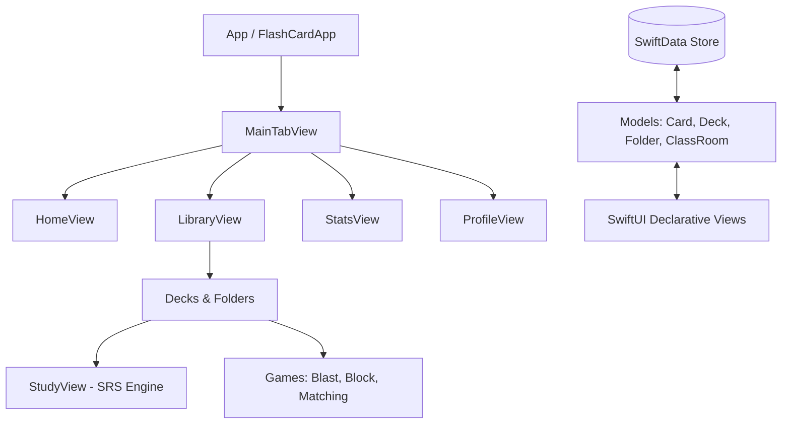

# LuminaCards
### Ứng dụng học từ vựng Spaced Repetition cao cấp trên iOS.

LuminaCards là ứng dụng iOS native được thiết kế với giao diện hiện đại tối ưu cho màn hình OLED (Dark Mode). Ứng dụng tích hợp thuật toán lặp lại ngắt quãng SuperMemo-2 (SM-2) để tối ưu hiệu quả học từ vựng, kết hợp các trò chơi tương tác, thống kê chi tiết, quản lý thư mục và lớp học mô phỏng.

---

## Các tính năng chính

### 1. Thuật toán Lặp lại ngắt quãng (SM-2)
* Vòng lặp ôn tập thông minh: Đánh giá hiệu quả học qua 4 mức độ: Học lại, Khó, Tốt, Dễ.
* Tự động điều chỉnh khoảng thời gian ôn tập: Thay đổi khoảng cách giữa các lần học, hệ số ghi nhớ và thời gian ôn tập tiếp theo.
* Thao tác trực quan: Lật thẻ 3D và vuốt để đánh giá kết quả đi kèm phản hồi rung (Haptics).

### 2. Trò chơi tương tác hóa
* Blast Game: Trò chơi ghép thẻ tốc độ cao.
* Block Game: Sắp xếp từ vựng theo dạng rơi khối.
* Matching Game: Ghép cặp từ vựng và định nghĩa trên ma trận.
* Chế độ Quiz: Trắc nghiệm nhanh chia theo phần với phản hồi rung khi chọn sai và hiệu ứng pháo hoa khi hoàn thành xuất sắc.

### 3. Quản lý Lớp học và Thư mục
* Quản lý lớp học: Cho phép tạo lớp học với mã mời riêng biệt để học sinh tham gia và chia sẻ các bộ thẻ từ vựng.
* Thư mục lồng nhau: Tổ chức các bộ thẻ theo cấu trúc thư mục nhiều cấp (ngôn ngữ, chủ đề, kỳ thi).

### 4. Thống kê học tập
* Bản đồ đóng góp: Theo dõi chuỗi học tập hàng ngày (tương tự đóng góp trên GitHub).
* Biểu đồ tiến độ: Theo dõi số lượng từ vựng đã ghi nhớ và cân bằng kỹ năng.

---

## Kiến trúc và Công nghệ

* Nền tảng: iOS 17.0+ (Swift 5.9+)
* Framework: SwiftUI (Giao diện lập trình khai báo)
* Cơ sở dữ liệu: SwiftData (Mô hình hóa giản đồ dữ liệu với cơ chế tự động di trú và cấu hình xóa tầng tự động)
* Kiến trúc: MVVM-C kết hợp truy vấn trực tiếp từ SwiftData trong View.
* Hệ thống giao diện: Sử dụng AppTheme hỗ trợ kích thước chữ linh hoạt, phản hồi rung (UIImpactFeedbackGenerator) và hiệu ứng chuyển cảnh mượt mà.



---

## Cấu trúc thư mục

```text
FlashCard-2/
├── App/                  # Khởi chạy ứng dụng và quản lý điều hướng
├── Models/               # Định nghĩa dữ liệu SwiftData và thuật toán lõi (SM-2)
├── Theme/                # Màu sắc, phông chữ và các thành phần giao diện dùng chung
├── Views/                # Các màn hình giao diện phân chia theo module tính năng
│   ├── Decks/            # Chi tiết bộ thẻ, bảng chỉnh sửa và tạo mới
│   ├── Library/          # Danh sách thư mục, bộ thẻ và lớp học
│   ├── Vocabulary/       # Quản lý từ vựng và gợi ý từ bằng AI
│   ├── QuickActions/     # Lối tắt ôn tập nhanh
│   └── Onboarding/       # Màn hình chào mừng và thiết lập mục tiêu
└── FlashCard-2Tests/     # Thư mục chứa các bài kiểm tra đơn vị cho thuật toán cốt lõi
```

---

## Kiểm thử

Thuật toán cốt lõi (SM-2) được bảo vệ bằng các bài kiểm tra đơn vị tự động để đảm bảo tính chính xác trong việc xếp lịch ôn tập:
* File test: FlashCard-2Tests/SM2AlgorithmTests.swift
* Cách chạy:
  1. Mở dự án trong Xcode.
  2. Chọn scheme FlashCard-2.
  3. Nhấn Cmd + U để thực thi bộ test.

---

## Hướng dẫn cài đặt

### Yêu cầu hệ thống
* Mac chạy macOS Sonoma trở lên.
* Xcode 15.0 trở lên.
* Thiết bị giả lập hoặc thiết bị thật chạy iOS 17.0 trở lên.

### Cài đặt
1. Tải mã nguồn:
   ```bash
   git clone https://github.com/giangnguyenhuy87/Flash-Card.git
   ```
2. Mở dự án bằng Xcode:
   ```bash
   cd ./FlashCard-2
   open FlashCard-2.xcodeproj
   ```
3. Chọn thiết bị giả lập hoặc thiết bị thật chạy iOS 17+.
4. Nhấn Cmd + R để chạy ứng dụng hoặc Cmd + U để chạy kiểm thử.
